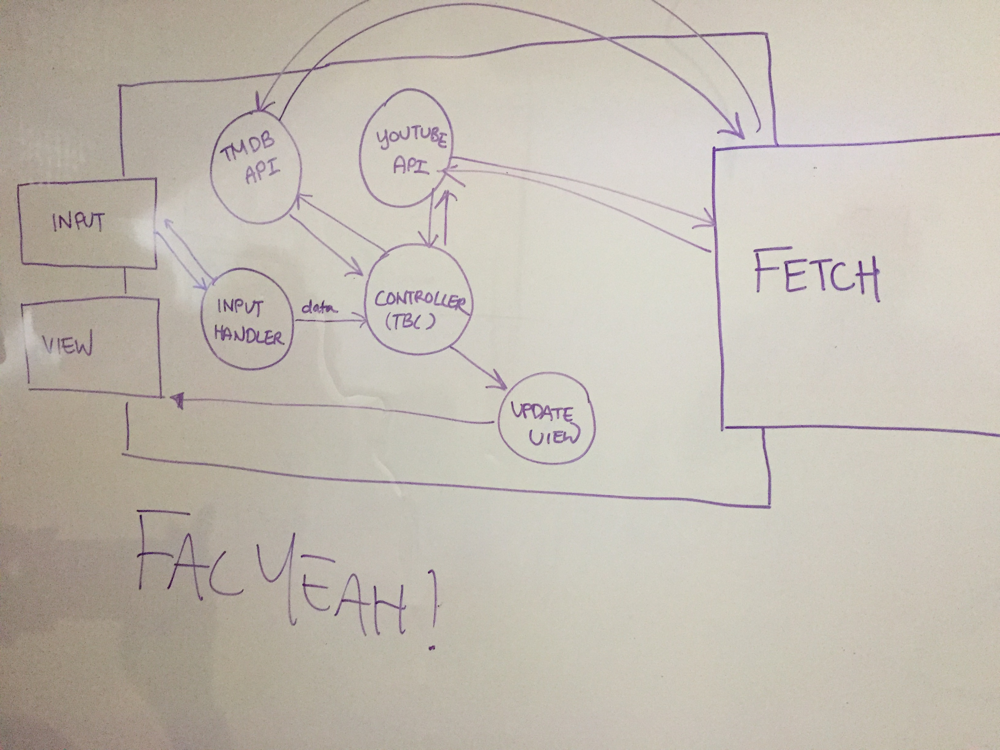

# week3-facxmachine-api
FACX Machine's awesome-tastic api project

Architecture
===

## Our **User Stories**
1. ~~I want to be able to search for two actors to see if they've been in a film together~~

2. ~~After finding out the two actors have been in a film together, show me that movie trailer~~

3. I want to be able to filter movies by ~~actors and~~ genre

4. I want to be able to read a NYT movie review based on my search results

5. I want to be able to watch the trailer associated with the movie results

## Using the YouTube API
1. We used the YouTube api by first identifying the endpoint which is `https://www.googleapis.com/youtube/v3/search?`
2. We then specified the `&q=OUR_QUERY` and `&videoDuration=short`, our `order=relevance` to ensure only relevant responses were returned
3. Our final query string was `https://www.googleapis.com/youtube/v3/search?part=snippet&order=relevance&q=the+help+trailer&type=video&videoDuration=short&key={YOUR_API_KEY}`

[Insert problems with YouTube API here]

## Using The Movie Database API
1. We request popular movies of a given genre using the relevant genre ID
2. The API returns an array of movie objects, which include the IDs for each movie
3. We make another request to the API for each movie, using the ID to ask for trailers
4. Finally we build an array of movie objects containing the title and YouTube key for the trailer

_After some unsuccessful API calls returning the results we didn't want, we switch paths with both TMDB and Youtube and pursued a third option:_

## Using The New York Times API
_At a glance:_
1. Base URL: `http://api.nytimes.com/svc/movies/{version}/{reviews}`

2. Scope: Movie reviews by New York Times critics

3. HTTP method : `GET`

4. Response formats: JSON (.json, default)

5. Final URL: `https://api.nytimes.com/svc/movies/v2/reviews/search.json?query=` + movie title searched + `&api-key=`;
